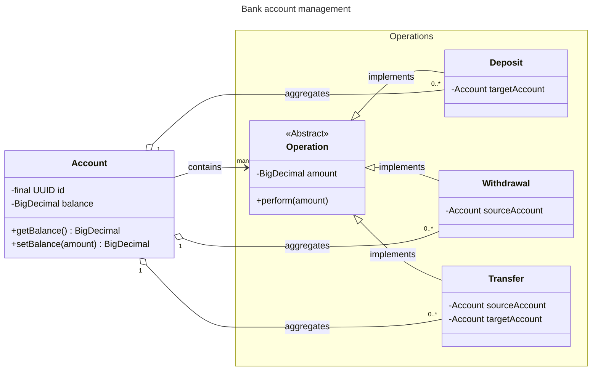

```mermaid
---
title: Bank account management
---

classDiagram
    direction LR

    class Account{
        -final UUID id
        -BigDecimal balance
        +getBalance() BigDecimal
        +setBalance(amount) BigDecimal
    }
    
    class Operation{
        %% абстрактный - существует только в контексте операций-наследников
        <<Abstract>>
        -BigDecimal amount
        +perform(amount)
    }

    %% связь со счетом
    Account --> "many" Operation : contains

    %% Пополнение    
    Operation <|-- Deposit : implements
    Deposit : -Account targetAccount

    Account "1" o-- "0..*" Deposit : aggregates


    %% Снятие
    Operation <|-- Withdrawal : implements
    %% Баланс >= сумма снятия
    Withdrawal : -Account sourceAccount
    
    Account "1" o-- "0..*" Withdrawal : aggregates
    

    %% Перевод
    Operation <|-- Transfer : implements
    %% Баланс >= сумма снятия
    Transfer : -Account sourceAccount
    Transfer : -Account targetAccount
    
    Account "1" o-- "0..*" Transfer : aggregates

    
    namespace Operations {
        class Operation
        class Deposit
        class Transfer
        class Withdrawal
    }
```