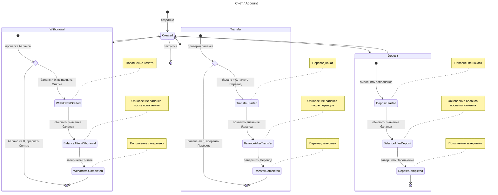

```mermaid
---
title: Счет / Account
---

stateDiagram-v2
    [*] --> Created : создание
    
    %% Пополнение
    Created --> Deposit
    
    state Deposit {
        [*] --> DepositStarted : выполнить пополнение
        DepositStarted --> BalanceAfterDeposit : обновить значение баланса
        BalanceAfterDeposit --> DepositCompleted : завершить Пополнение
        DepositCompleted --> [*]
    }
    Deposit --> Created

    note left of DepositStarted
        Пополнение начато
    end note
    note left of BalanceAfterDeposit
        Обновление баланса после пополнения
    end note
    note left of DepositCompleted
        Пополнение завершено
    end note

    %% Снятие
    Created --> Withdrawal
    

    state if_balance_positive_Withdrawal <<choice>>
    state Withdrawal {
        [*] --> if_balance_positive_Withdrawal : проверка баланса
        if_balance_positive_Withdrawal --> [*] : баланс <= 0, прервать Снятие

        if_balance_positive_Withdrawal --> WithdrawalStarted : баланс > 0, выполнить Снятие
        WithdrawalStarted --> BalanceAfterWithdrawal : обновить значение баланса
        BalanceAfterWithdrawal --> WithdrawalCompleted : завершить Снятие
        WithdrawalCompleted --> [*]
    }
    Withdrawal --> Created

    note left of WithdrawalStarted
        Пополнение начато
    end note
    note left of BalanceAfterWithdrawal
        Обновление баланса после пополнения
    end note
    note left of WithdrawalCompleted
        Пополнение завершено
    end note


    %% Перевод
    Created --> Transfer

    state if_balance_positive_Transfer <<choice>>
    state Transfer {
        [*] --> if_balance_positive_Transfer : проверка баланса
        if_balance_positive_Transfer --> [*] : баланс <= 0, прервать Перевод

        if_balance_positive_Transfer --> TransferStarted : баланс > 0, начать Перевод
        TransferStarted --> BalanceAfterTransfer : обновить значение баланса
        BalanceAfterTransfer --> TransferCompleted : завершить Перевод
        TransferCompleted --> [*]
    }
    Transfer --> Created

    note left of TransferStarted
        Перевод начат
    end note
    note left of BalanceAfterTransfer
        Обновление баланса после перевода
    end note
    note left of TransferCompleted
        Перевод завершен
    end note

    Created --> [*] : закрытие

```