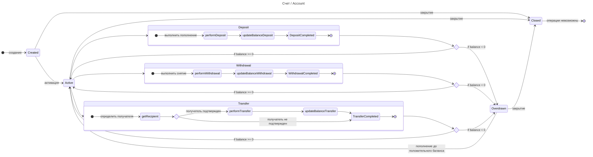

```mermaid

---
title: Счет / Account
---

stateDiagram-v2
    direction LR
    %%Created : создан, не активен
    %%Active : активен, баланс > 0, операции возможны
    %%Overdrawn : активен, баланс < 0, операции невозможны
    %%Closed : закрыт

    [*] --> Created : создание
    Created --> Active : активация

    %% Операции

    %% Пополнение
    Active --> Deposit
    
    state if_balance_positive_Deposit <<choice>>

    state Deposit {
        direction LR
        [*] --> performDeposit : выполнить пополнение
        performDeposit --> updateBalanceDeposit
        updateBalanceDeposit --> DepositCompleted
        DepositCompleted --> [*]
    }
    Deposit --> if_balance_positive_Deposit
    if_balance_positive_Deposit --> Active : if balance >= 0
    if_balance_positive_Deposit --> Overdrawn: if balance < 0


    %% Снятие
    Active --> Withdrawal
    
    state Withdrawal {
        direction LR
        [*] --> performWithdrawal : выполнить снятие
        performWithdrawal --> updateBalanceWithdrawal
        updateBalanceWithdrawal --> WithdrawalCompleted
        WithdrawalCompleted --> [*]
    }

    state if_balance_positive_Withdrawal <<choice>>
    Withdrawal --> if_balance_positive_Withdrawal
    if_balance_positive_Withdrawal --> Active : if balance >= 0
    if_balance_positive_Withdrawal --> Overdrawn: if balance < 0


    %% Перевод
    Active --> Transfer

    state if_valid_recipient <<choice>>
    state Transfer {
        direction LR
        [*] --> getRecipient : определить получателя
        getRecipient --> if_valid_recipient
        if_valid_recipient --> performTransfer : получатель подтвержден
        performTransfer --> updateBalanceTransfer
        updateBalanceTransfer --> TransferCompleted
        if_valid_recipient --> TransferCompleted : получатель не подтвержден
        TransferCompleted --> [*]
    }

    state if_balance_positive_Transfer <<choice>>
    Transfer --> if_balance_positive_Transfer
    if_balance_positive_Transfer --> Active : if balance >= 0
    if_balance_positive_Transfer --> Overdrawn: if balance < 0

    Overdrawn --> Active : пополнение до положительного баланса

    Created --> Closed : закрытие
    Active --> Closed : закрытие
    Overdrawn --> Closed : закрытие

    Closed --> [*] : операции невозможны

```