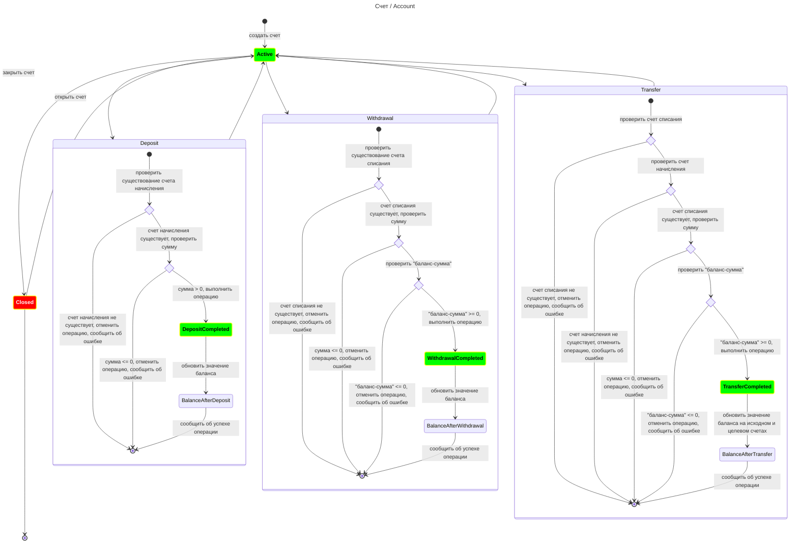

```mermaid
---
title: Счет / Account
---

stateDiagram-v2
    direction TB
    classDef trueBranch fill:#00ff00,color:black,font-weight:bold,stroke-width:2px,stroke:yellow
    classDef falseBranch fill:#f00,color:white,font-weight:bold,stroke-width:2px,stroke:yellow

    [*] --> Active : создать счет
    
    Active --> Closed : закрыть счет
    Closed --> Active : открыть счет

    %% Пополнение
    Active --> Deposit

    
    state Deposit {
        state if_account_exists_Deposit <<choice>>    
        [*] --> if_account_exists_Deposit : проверить существование счета начисления
        if_account_exists_Deposit --> [*] : счет начисления не существует, отменить операцию, сообщить об ошибке

        state if_sum_positive_Deposit <<choice>>
        if_account_exists_Deposit --> if_sum_positive_Deposit : счет начисления существует, проверить сумму
        if_sum_positive_Deposit --> [*] : сумма <= 0, отменить операцию, сообщить об ошибке

        if_sum_positive_Deposit --> DepositCompleted : сумма > 0, выполнить операцию
        DepositCompleted --> BalanceAfterDeposit : обновить значение баланса
        BalanceAfterDeposit --> [*] : сообщить об успехе операции

    }
    Deposit --> Active


    %% Снятие
    Active --> Withdrawal
    

    
    state Withdrawal {
        state if_account_exists_Withdrawal <<choice>>  
        [*] --> if_account_exists_Withdrawal : проверить существование счета списания
        if_account_exists_Withdrawal --> [*] : счет списания не существует, отменить операцию, сообщить об ошибке

        state if_sum_positive_Withdrawal <<choice>>
        if_account_exists_Withdrawal --> if_sum_positive_Withdrawal : счет списания существует, проверить сумму
        if_sum_positive_Withdrawal --> [*] : сумма <= 0, отменить операцию, сообщить об ошибке
        
        state if_balance_positive_Withdrawal <<choice>>      
        if_sum_positive_Withdrawal --> if_balance_positive_Withdrawal : проверить "баланс-сумма"
        if_balance_positive_Withdrawal --> WithdrawalCompleted : "баланс-сумма" >= 0, выполнить операцию
        if_balance_positive_Withdrawal --> [*] : "баланс-сумма" <= 0, отменить операцию, сообщить об ошибке

        WithdrawalCompleted --> BalanceAfterWithdrawal : обновить значение баланса
        BalanceAfterWithdrawal --> [*] : сообщить об успехе операции

    }
    Withdrawal --> Active


    %% Перевод
    Active --> Transfer
    
    state Transfer {

        state if_source_account_exists_Transfer <<choice>>    
        [*] --> if_source_account_exists_Transfer : проверить счет списания
        if_source_account_exists_Transfer --> [*] : счет списания не существует, отменить операцию, сообщить об ошибке

        state if_target_account_exists_Transfer <<choice>>    
        if_source_account_exists_Transfer --> if_target_account_exists_Transfer : проверить счет начисления
        if_target_account_exists_Transfer --> [*] : счет начисления не существует, отменить операцию, сообщить об ошибке

        state if_sum_positive_Transfer <<choice>>
        if_target_account_exists_Transfer --> if_sum_positive_Transfer : счет списания существует, проверить сумму
        if_sum_positive_Transfer --> [*] : сумма <= 0, отменить операцию, сообщить об ошибке

        state if_balance_positive_Transfer <<choice>>
        if_sum_positive_Transfer --> if_balance_positive_Transfer : проверить "баланс-сумма"
        if_balance_positive_Transfer --> [*] : "баланс-сумма" <= 0, отменить операцию, сообщить об ошибке

        if_balance_positive_Transfer --> TransferCompleted : "баланс-сумма" >= 0, выполнить операцию

        TransferCompleted --> BalanceAfterTransfer : обновить значение баланса на исходном и целевом счетах
        BalanceAfterTransfer --> [*] : сообщить об успехе операции

    }
    Transfer --> Active


    Closed --> [*]

    %% Стили
    class Active, DepositCompleted, WithdrawalCompleted, TransferCompleted trueBranch
    class Closed falseBranch

```