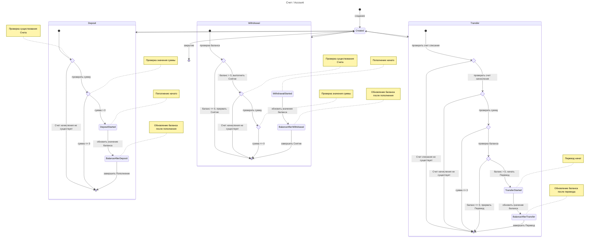

```mermaid
---
title: Счет / Account
---

stateDiagram-v2
    [*] --> Created : создание
    
    %% Пополнение
    Created --> Deposit

    
    state Deposit {
        state if_account_exists_Deposit <<choice>>    
        [*] --> if_account_exists_Deposit
        if_account_exists_Deposit --> [*] : Счет начисления не существует

        state if_sum_positive_Deposit <<choice>>
        if_account_exists_Deposit --> if_sum_positive_Deposit : проверить сумму
        if_sum_positive_Deposit --> [*] : сумма <= 0

        if_sum_positive_Deposit --> DepositStarted : сумма > 0
        DepositStarted --> BalanceAfterDeposit : обновить значение баланса
        BalanceAfterDeposit --> [*] : завершить Пополнение

        note left of if_account_exists_Deposit
            Проверка существования Счета
        end note
        note left of if_sum_positive_Deposit
            Проверка значения суммы
        end note

        note left of DepositStarted
            Пополнение начато
        end note
        note left of BalanceAfterDeposit
            Обновление баланса после пополнения
        end note
    }
    Deposit --> Created


    %% Снятие
    Created --> Withdrawal
    

    state if_balance_positive_Withdrawal <<choice>>
    state Withdrawal {
        [*] --> if_balance_positive_Withdrawal : проверка баланса
        if_balance_positive_Withdrawal --> [*] : баланс <= 0, прервать Снятие

        state if_account_exists_Withdrawal <<choice>>    
        if_balance_positive_Withdrawal --> if_account_exists_Withdrawal : баланс > 0, выполнить Снятие
        if_account_exists_Withdrawal --> [*] : Счет начисления не существует

        state if_sum_positive_Withdrawal <<choice>>
        if_account_exists_Withdrawal --> if_sum_positive_Withdrawal : проверить сумму
        if_sum_positive_Withdrawal --> [*] : сумма <= 0
        
        WithdrawalStarted --> BalanceAfterWithdrawal : обновить значение баланса
        BalanceAfterWithdrawal --> [*] : завершить Снятие


        note left of if_account_exists_Withdrawal
            Проверка существования Счета
        end note
        note left of if_sum_positive_Withdrawal
            Проверка значения суммы
        end note

        note left of WithdrawalStarted
            Пополнение начато
        end note
        note left of BalanceAfterWithdrawal
            Обновление баланса после пополнения
        end note

    }
    Withdrawal --> Created


    %% Перевод
    Created --> Transfer
    
    state Transfer {

        state if_source_account_exists_Transfer <<choice>>    
        [*] --> if_source_account_exists_Transfer : проверить счет списания
        if_source_account_exists_Transfer --> [*] : Счет списания не существует

        state if_target_account_exists_Transfer <<choice>>    
        if_source_account_exists_Transfer --> if_target_account_exists_Transfer : проверить счет начисления
        if_target_account_exists_Transfer --> [*] : Счет начисления не существует

        state if_sum_positive_Transfer <<choice>>
        if_target_account_exists_Transfer --> if_sum_positive_Transfer : проверить сумму
        if_sum_positive_Transfer --> [*] : сумма <= 0

        state if_balance_positive_Transfer <<choice>>
        if_sum_positive_Transfer --> if_balance_positive_Transfer : проверка баланса
        if_balance_positive_Transfer --> [*] : баланс <= 0, прервать Перевод

        if_balance_positive_Transfer --> TransferStarted : баланс > 0, начать Перевод

        TransferStarted --> BalanceAfterTransfer : обновить значение баланса
        BalanceAfterTransfer --> [*] : завершить Перевод

        note left of TransferStarted
            Перевод начат
        end note
        note left of BalanceAfterTransfer
            Обновление баланса после перевода
        end note
    }
    Transfer --> Created

    Created --> [*] : закрытие

```