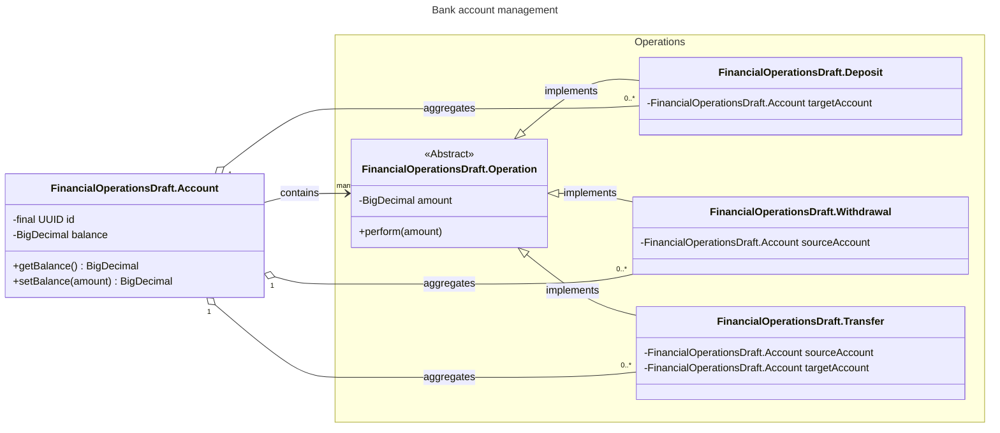

```mermaid
---
title: Bank account management
---

classDiagram
    direction LR

    class FinancialOperationsDraft.Account{
        -final UUID id
        -BigDecimal balance
        +getBalance() BigDecimal
        +setBalance(amount) BigDecimal
    }
    
    class FinancialOperationsDraft.Operation{
        %% абстрактный - существует только в контексте операций-наследников
        <<Abstract>>
        -BigDecimal amount
        +perform(amount)
    }

    %% связь со счетом
    FinancialOperationsDraft.Account --> "many" FinancialOperationsDraft.Operation : contains

    %% Пополнение    
    FinancialOperationsDraft.Operation <|-- FinancialOperationsDraft.Deposit : implements
    FinancialOperationsDraft.Deposit : -FinancialOperationsDraft.Account targetAccount

    FinancialOperationsDraft.Account "1" o-- "0..*" FinancialOperationsDraft.Deposit : aggregates


    %% Снятие
    FinancialOperationsDraft.Operation <|-- FinancialOperationsDraft.Withdrawal : implements
    %% Баланс >= сумма снятия
    FinancialOperationsDraft.Withdrawal : -FinancialOperationsDraft.Account sourceAccount
    
    FinancialOperationsDraft.Account "1" o-- "0..*" FinancialOperationsDraft.Withdrawal : aggregates
    

    %% Перевод
    FinancialOperationsDraft.Operation <|-- FinancialOperationsDraft.Transfer : implements
    %% Баланс >= сумма снятия
    FinancialOperationsDraft.Transfer : -FinancialOperationsDraft.Account sourceAccount
    FinancialOperationsDraft.Transfer : -FinancialOperationsDraft.Account targetAccount
    
    FinancialOperationsDraft.Account "1" o-- "0..*" FinancialOperationsDraft.Transfer : aggregates

    
    namespace Operations {
        class FinancialOperationsDraft.Operation
        class FinancialOperationsDraft.Deposit
        class FinancialOperationsDraft.Transfer
        class FinancialOperationsDraft.Withdrawal
    }
```