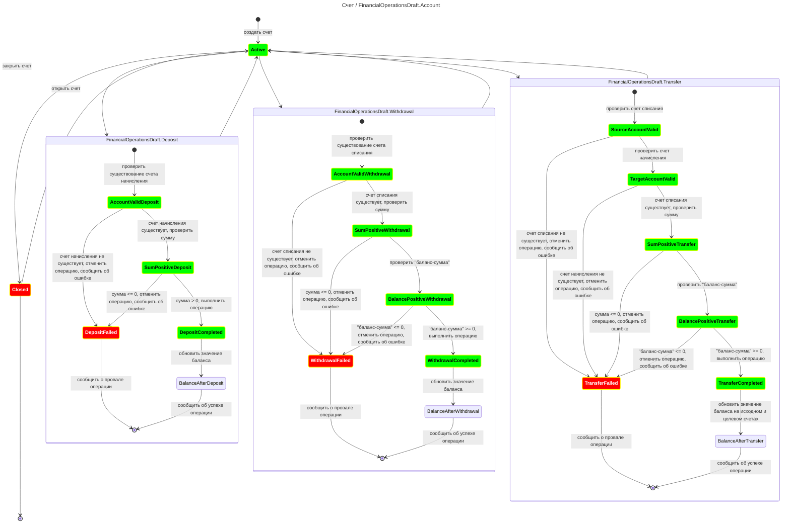

```mermaid
---
title: Счет / FinancialOperationsDraft.Account
---

stateDiagram-v2
    direction TB
    classDef trueBranch fill:#00ff00,color:black,font-weight:bold,stroke-width:2px,stroke:yellow
    classDef falseBranch fill:#f00,color:white,font-weight:bold,stroke-width:2px,stroke:yellow

    [*] --> Active : создать счет
    Active --> Closed : закрыть счет
    Closed --> Active : открыть счет

    %% Пополнение
    Active --> FinancialOperationsDraft.Deposit

    
    state FinancialOperationsDraft.Deposit {
        [*] --> AccountValidDeposit : проверить существование счета начисления
        AccountValidDeposit --> DepositFailed : счет начисления не существует, отменить операцию, сообщить об ошибке

        AccountValidDeposit --> SumPositiveDeposit : счет начисления существует, проверить сумму
        SumPositiveDeposit --> DepositFailed : сумма <= 0, отменить операцию, сообщить об ошибке

        SumPositiveDeposit --> DepositCompleted : сумма > 0, выполнить операцию
        DepositCompleted --> BalanceAfterDeposit : обновить значение баланса
        BalanceAfterDeposit --> [*] : сообщить об успехе операции

        DepositFailed --> [*] : сообщить о провале операции
    }
    FinancialOperationsDraft.Deposit --> Active


    %% Снятие
    Active --> FinancialOperationsDraft.Withdrawal
    

    
    state FinancialOperationsDraft.Withdrawal {
        [*] --> AccountValidWithdrawal : проверить существование счета списания
        AccountValidWithdrawal --> WithdrawalFailed : счет списания не существует, отменить операцию, сообщить об ошибке

        AccountValidWithdrawal --> SumPositiveWithdrawal : счет списания существует, проверить сумму
        SumPositiveWithdrawal --> WithdrawalFailed : сумма <= 0, отменить операцию, сообщить об ошибке
        
        SumPositiveWithdrawal --> BalancePositiveWithdrawal : проверить "баланс-сумма"
        BalancePositiveWithdrawal --> WithdrawalFailed : "баланс-сумма" <= 0, отменить операцию, сообщить об ошибке
        BalancePositiveWithdrawal --> WithdrawalCompleted : "баланс-сумма" >= 0, выполнить операцию

        WithdrawalCompleted --> BalanceAfterWithdrawal : обновить значение баланса
        BalanceAfterWithdrawal --> [*] : сообщить об успехе операции

        WithdrawalFailed --> [*] : сообщить о провале операции
    }
    FinancialOperationsDraft.Withdrawal --> Active


    %% Перевод
    Active --> FinancialOperationsDraft.Transfer
    
    state FinancialOperationsDraft.Transfer {

        [*] --> SourceAccountValid : проверить счет списания
        SourceAccountValid --> TransferFailed : счет списания не существует, отменить операцию, сообщить об ошибке

        SourceAccountValid --> TargetAccountValid : проверить счет начисления
        TargetAccountValid --> TransferFailed : счет начисления не существует, отменить операцию, сообщить об ошибке

        TargetAccountValid --> SumPositiveTransfer : счет списания существует, проверить сумму
        SumPositiveTransfer --> TransferFailed : сумма <= 0, отменить операцию, сообщить об ошибке

        SumPositiveTransfer --> BalancePositiveTransfer : проверить "баланс-сумма"
        BalancePositiveTransfer --> TransferFailed : "баланс-сумма" <= 0, отменить операцию, сообщить об ошибке

        BalancePositiveTransfer --> TransferCompleted : "баланс-сумма" >= 0, выполнить операцию

        TransferCompleted --> BalanceAfterTransfer : обновить значение баланса на исходном и целевом счетах
        BalanceAfterTransfer --> [*] : сообщить об успехе операции

        TransferFailed --> [*] : сообщить о провале операции

    }
    FinancialOperationsDraft.Transfer --> Active


    %% Стили
    %% Общие
    class Active, DepositCompleted, WithdrawalCompleted, TransferCompleted trueBranch
    class Closed, DepositFailed, WithdrawalFailed, TransferFailed falseBranch

    %% Пополнение
    class AccountValidDeposit, SumPositiveDeposit, BalancePositiveDeposit trueBranch

    %% Снятие
    class AccountValidWithdrawal, SumPositiveWithdrawal, BalancePositiveWithdrawal trueBranch

    %% Перевод
    class SourceAccountValid, TargetAccountValid, SumPositiveTransfer, BalancePositiveTransfer trueBranch

    Closed --> [*]

```