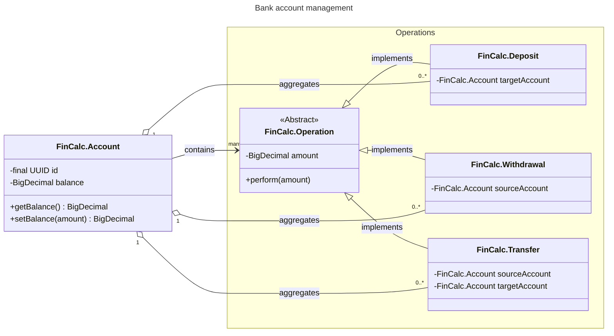

```mermaid
---
title: Bank account management
---

classDiagram
    direction LR

    class FinCalc.Account{
        -final UUID id
        -BigDecimal balance
        +getBalance() BigDecimal
        +setBalance(amount) BigDecimal
    }
    
    class FinCalc.Operation{
        %% абстрактный - существует только в контексте операций-наследников
        <<Abstract>>
        -BigDecimal amount
        +perform(amount)
    }

    %% связь со счетом
    FinCalc.Account --> "many" FinCalc.Operation : contains

    %% Пополнение    
    FinCalc.Operation <|-- FinCalc.Deposit : implements
    FinCalc.Deposit : -FinCalc.Account targetAccount

    FinCalc.Account "1" o-- "0..*" FinCalc.Deposit : aggregates


    %% Снятие
    FinCalc.Operation <|-- FinCalc.Withdrawal : implements
    %% Баланс >= сумма снятия
    FinCalc.Withdrawal : -FinCalc.Account sourceAccount
    
    FinCalc.Account "1" o-- "0..*" FinCalc.Withdrawal : aggregates
    

    %% Перевод
    FinCalc.Operation <|-- FinCalc.Transfer : implements
    %% Баланс >= сумма снятия
    FinCalc.Transfer : -FinCalc.Account sourceAccount
    FinCalc.Transfer : -FinCalc.Account targetAccount
    
    FinCalc.Account "1" o-- "0..*" FinCalc.Transfer : aggregates

    
    namespace Operations {
        class FinCalc.Operation
        class FinCalc.Deposit
        class FinCalc.Transfer
        class FinCalc.Withdrawal
    }
```